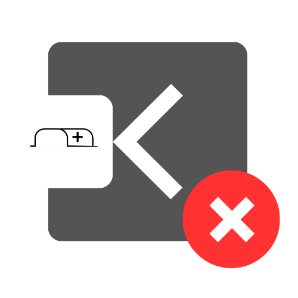
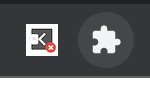
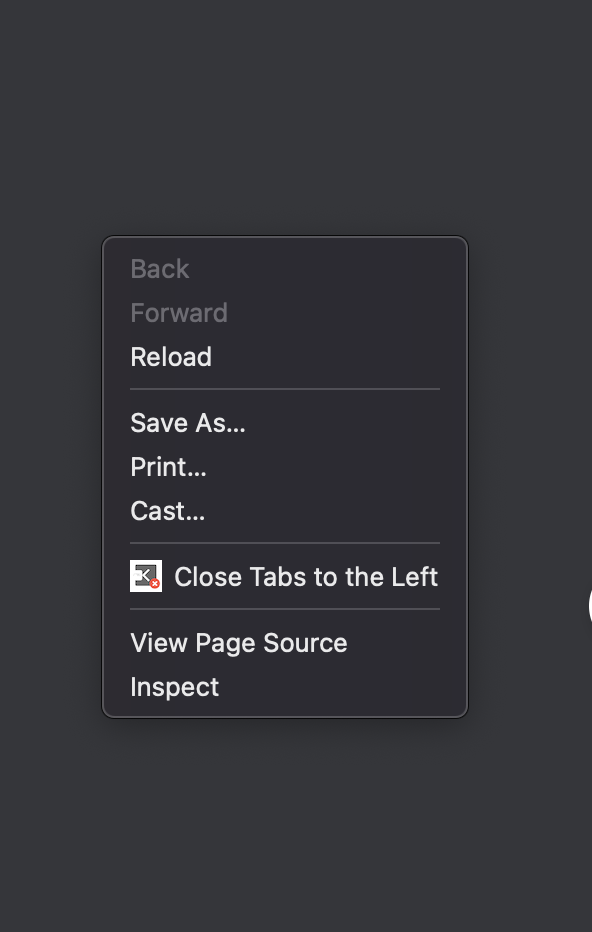
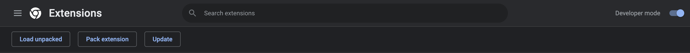

# Close Left Tabs Web Extension

## About
Close Left Tabs is a web extension that allows you to close tabs to the left. Most modern browsers only provide the option to close the current tab, other tabs and tabs to the right.

## Ways to Use this extension
1. By clicking on the extension icon 
    - 
2. By right clicking on a page and choosing "Close Tabs to the Left"
    - 

3. Keyboard shortcut - windows (Ctrl + Shift + L), mac (Command + Shift + L). You can also change the shortcut to whatever you like at chrome://extensions/shortcuts

## Tech Stack
1. Javascript

## How to run the project?
1. Click [here](https://github.com/bolu-tife/close-left-tabs-web-extension/archive/refs/heads/main.zip) to download or clone this repo at https://github.com/bolu-tife/close-left-tabs-web-extension.git
2. Enter chrome://extensions or click the extensions icon and go to manage extensions
3. Turn on Developer mode
4. Click on Load unpacked and locate the folder of this repository.

